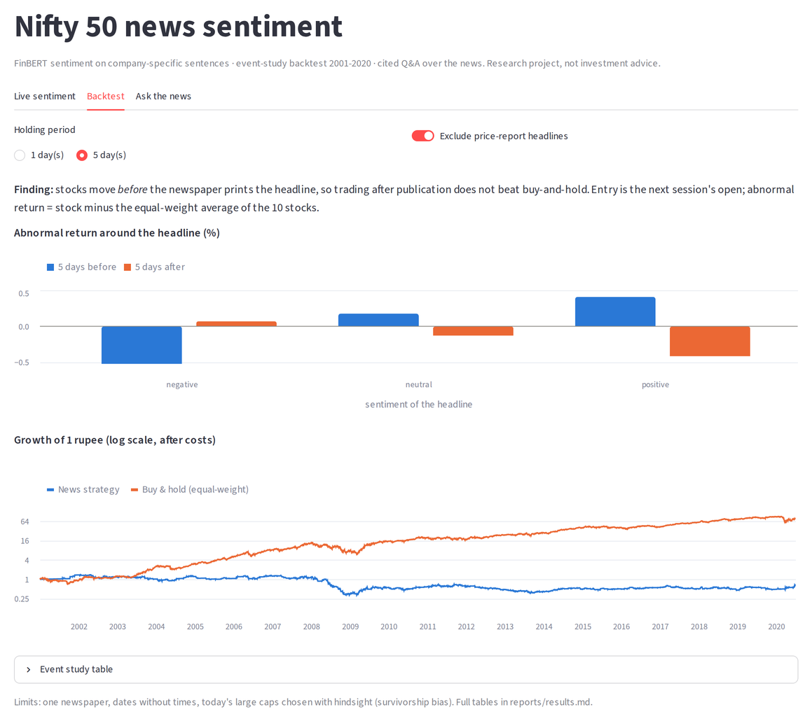
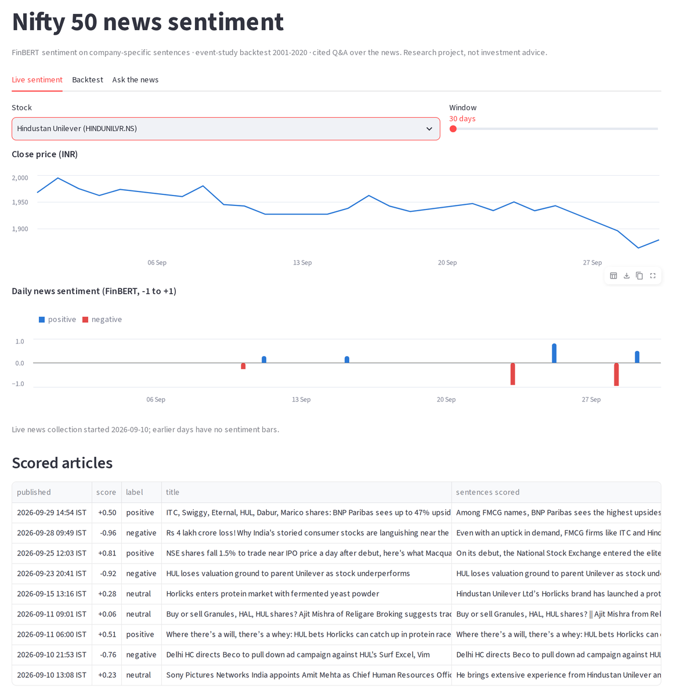

# Does financial news predict Indian stock returns?

[](https://github.com/Arocks1674/fin-sentiment-trader/actions/workflows/tests.yml)

[](LICENSE)

A research pipeline for 10 Nifty 50 stocks: it collects news and prices, scores
**company-specific** sentiment with FinBERT, tests 20 years of headlines in an event-study
backtest, answers questions over the news with a cited RAG layer, and shows it all in a
Streamlit dashboard.

**Finding: newspaper sentiment arrives after the price has moved.** Stocks rise in the
5 days *before* a positive headline and fall before a negative one, so trading after
publication does not beat buy-and-hold.

| News (4,388 Times of India headlines, 2001 to mid-2020) | 5 days before the headline | 5 days after entry |
|---|---|---|
| Positive | **+0.50%** (t = 4.2) | −0.44% (t = −4.5) |
| Negative | **−0.86%** (t = −4.9) | +0.10% (t = 0.7, not significant) |
| Positive minus negative | **+1.36%** (placebo range ±0.40%, p < 0.001) | −0.54% (placebo range ±0.34%, p = 0.003) |

<sub>Abnormal return = stock return minus the equal-weight average of the 10 stocks. Entry at the next
session's open; price-report headlines included. Placebo = the same test with sentiment scores shuffled
across events 2,000 times (`python backtest.py --placebo`).</sub>

Part of the post-headline drop is not about tone: **every** news day is followed by about −0.18% over
5 days (t = −2.9), whatever the sentiment. The spread against shuffled scores separates the two.



## How it works

| Module | What it does | Code |
|---|---|---|
| 1. Ingestion | GNews API and yfinance into SQLite; each article stored once and linked to every stock it mentions | `ingest.py`, `src/ingest`, `src/storage` |
| 2. Sentiment | FinBERT scores only the sentences about each company; drops source-only and list mentions, sister companies and syndicated copies; daily aggregate in IST | `score.py`, `src/sentiment` |
| 3. Backtest | Event study and long-only strategy with next-session entry, 0.25% costs, cleaned prices, in/out-of-sample split | `backtest.py`, `src/backtest` |
| 4. RAG | MiniLM embeddings in Chroma, filtered by stock and date; Gemini (via LangChain) answers only from retrieved items and cites each claim | `rag.py`, `src/rag` |
| 5. Dashboard | Streamlit + Altair: live sentiment, backtest, "ask the news" | `app.py`, `src/app` |

### Sentiment that is actually about the company

Scoring whole articles failed when I read the most extreme scores. Each problem below became a rule
and a unit test (`src/sentiment/entities.py`):

| Problem found in live data | Example | Fix |
|---|---|---|
| Company is the source, not the subject | "...support manufacturing growth: ICICI Bank" | Trailing `: Name`, "according to Name", "Name economists", "Chief Economist, Name" are not mentions |
| Title about the sector, description about the company | "IT Stocks Rally" / "Infosys was the only stock trading lower" | Score only sentences that mention the company |
| One story, several URLs | One ICICI story counted 3 times | Collapse identical titles or identical scored sentences per stock per day |
| Company is one name in a list | "Stocks to watch: ..., Reliance, Bharti..." | Mentions in a list of 4+ names are dropped |
| Sentence only reports a price move | "Reliance Industries has fallen 25% in 2026" | Flagged; the backtest is run with and without these |
| Ambiguous names | Bare "Reliance" meant an Anil Ambani company 30% of the time | Only unambiguous names (Reliance Industries, RIL, Jio); sister companies excluded |

Score per (article, company) = mean of FinBERT `P(positive) − P(negative)` over the relevant sentences, in [−1, 1].

### Backtest design

- **Data:** Times of India headline archive ([Harvard Dataverse](https://doi.org/10.7910/DVN/DPQMQH), CC0), filtered with the same entity rules. Most stocks have news on only 10–40 days a year, so the test is **event-driven and pooled** across stocks.
- **No lookahead:** headlines have dates but no times, so a headline dated D is traded at the **open of the first session after D**.
- **Strategy:** long-only on positive news (threshold 0.3), hold 1 or 5 sessions, 0.25% round-trip cost, idle cash earns 6.5% a year. Parameters were fixed before testing; 2015 to mid-2020 is out-of-sample.
- **Placebo:** scores are shuffled across events 2,000 times. The before-headline spread is far outside the shuffled range in every variant; the after-entry spread is significant only for the 5-day hold ([`reports/placebo.md`](reports/placebo.md)).
- **Strategy and benchmark** are scored only over the news period (first entry to last exit, May 2001 to July 2020), not on later years with no headlines.
- **Price cleaning:** Yahoo's old NSE data had pre-listing rows, zero-volume holiday rows with unadjusted prices (Kotak +381% then −80%) and a bad bonus tick. `clean_prices` removes 1,024 rows; without it, buy-and-hold showed 43% a year.

Strategy vs equal-weight buy-and-hold, 5-day hold, price-report headlines excluded:

| Period | Strategy CAGR | Strategy Sharpe | Strategy max DD | Buy & hold CAGR | Buy & hold Sharpe |
|---|---|---|---|---|---|
| 2001–2014 (in-sample) | −5.3% | −0.39 | −77% | 32.4% | 0.98 |
| 2015–mid 2020 (out-of-sample) | 5.7% | 0.03 | −29% | 13.9% | 0.45 |

All four variants are in [`reports/results.md`](reports/results.md). The 1-day versions lose heavily after costs.

### Ask the news (RAG)

`python rag.py ask "Why did Infosys shares fall recently?"`

1. Stocks in the question are detected with the same entity rules ("ICICI Prudential" is not ICICI Bank); "recently", "latest" or "this week" add a 60-day date filter.
2. The top k items by cosine similarity are retrieved from Chroma, filtered by stock and date.
3. Gemini (temperature 0) must cite an item for every claim and use no outside knowledge.
4. No matching news means no LLM call. Citations that don't match a supplied item are flagged.



## Run it

Windows (Command Prompt); on macOS/Linux use `source .venv/bin/activate` and `cp`.

```bat
git clone https://github.com/Arocks1674/fin-sentiment-trader.git
cd fin-sentiment-trader
python -m venv .venv
.venv\Scripts\activate
pip install -r requirements.txt
copy .env.example .env
```

Add a [GNews](https://gnews.io) key and a [Gemini](https://aistudio.google.com) key to `.env` (git-ignored). Then:

```bat
python -m pytest -q                                  :: 67 tests, no network needed
python ingest.py                                     :: prices + latest news (10 GNews requests)
python score.py                                      :: FinBERT scores per company (score.py --audit shows dropped articles)
python coverage.py                                   :: download the headline archive, coverage per stock per year
python ingest.py --prices-only --start 2001-01-01    :: price history for the backtest
python backtest.py                                   :: writes reports/results.md and reports/equity.png
python backtest.py --placebo                         :: permutation test, writes reports/placebo.md
python rag.py index                                  :: embed stored news into Chroma
python rag.py ask "What did RIL announce?"           :: cited answer
streamlit run app.py                                 :: dashboard at http://localhost:8501
```

First runs download FinBERT (~440 MB) and MiniLM (~90 MB).

## Project layout

```
app.py  ingest.py  score.py  coverage.py  backtest.py  rag.py   entry points
config.py                                                     settings, tickers, paths
src/ingest      GNews, yfinance, archive download, price cleaning
src/storage     SQLite schema and queries
src/sentiment   entity rules, FinBERT scorer, daily aggregation
src/backtest    event study, portfolio, metrics
src/rag         corpus, Chroma store, retrieval + cited answers
src/app         dashboard data shaping and charts
tests/          67 pytest tests (fake embeddings and LLM for RAG)
```

## Limits

- One newspaper, headlines only, dates without times: you cannot trade before the move.
- Survivorship bias: the 10 stocks are today's large caps, chosen with hindsight, which flatters buy-and-hold.
- FinBERT measures tone, not size: a 0.55% dip can score −0.97.
- Passing mentions still count (a building fire near a Kotak branch scored −0.84 for Kotak); fixing this needs a relevance model, not more rules.
- GNews' free tier keeps about 30 days of history, so live sentiment can't be backtested yet.
- RAG answers are only as complete as the stored news; there is no formal retrieval evaluation yet.

Research project, not investment advice.

## License

[MIT](LICENSE)
